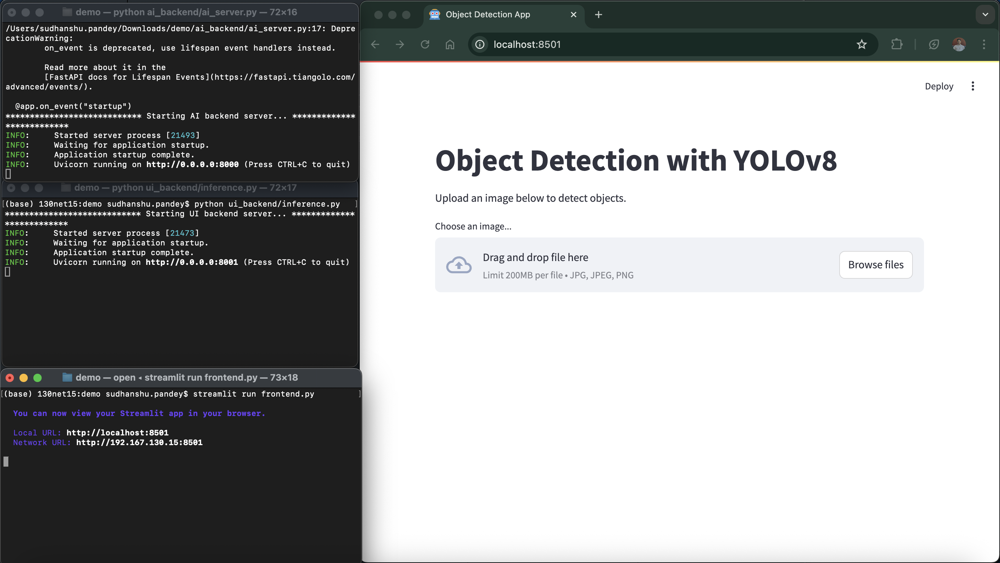
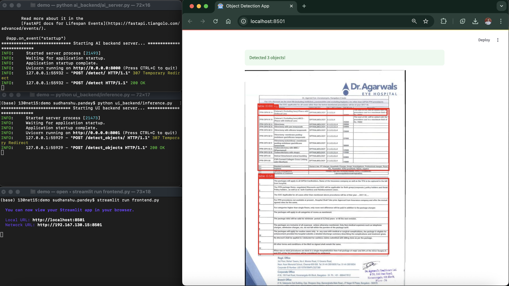

# Object Detection Microservice Demo

# Demo Images
<table>
<tr>
<td>

#### Image showing the `ui-backend server`, `ai-backend server` and the streamlit app running in local host 



</td>

</tr>


<tr>
<td>

#### Image showing the `ui-backend server`, `ai-backend server` and the streamlit app running in local host with the uploaded image and the detected objects 



</td>
</tr>
</table>

## Description

About the model used:

This is the YOLOv8s model used from one of my own open-source projects.
This you can find here: [table-transformer : https://github.com/Sudhanshu1304/table-transformer](https://github.com/Sudhanshu1304/table-transformer)

> The model detects the table in the image and returns the bounding box coordinates.

### Project Directory Structure

> python version used: 3.13.3

```
.
|-- ai-backend/
|   |-- model/
|   |-- utils/
|   |   |-- schema.py
|   |   `-- table_detection.py
|   |-- ai_service.py
|   `-- Dockerfile.ai
|-- ui-backend/
|   |-- main.py
|   `-- Dockerfile.ui
|-- static/
|-- docker-compose.yml
`-- requirements.txt
```

For the sake of simplicity, I have used the same requirements.txt for both services.

### Project Structure
* `ai-backend/`: Contains the AI microservice.
    * `ai_service.py`: The FastAPI server that hosts the object detection model.
    * `model/`: Contains the YOLO model file.
    * `utils/`: Utility module for helper functions and data schemas.
    * `Dockerfile.ai`: Docker configuration for the AI backend.
* `ui-backend/`: Contains the UI microservice.
    * `main.py`: The FastAPI server that handles image uploads and forwards them to the AI backend.
    * `Dockerfile.ui`: Docker configuration for the UI backend.
* `static/`: Contains the demo vedio and images.
* `docker-compose.yml`: Orchestrates and manages the two services, allowing them to run in a single command.
* `requirements.txt`: A single file containing all Python dependencies for both services.

## How to Run
You have two options for running the application.

### Option 1: Using Docker
This method ensures a consistent environment without worrying about local dependencies.

1. Build and Start: From the root directory of the project (where docker-compose.yml is located), run the following command to build the images and start both services:

    ```
    docker-compose up --build -d
    ```

    The --build flag ensures that a fresh image is built if any code changes have been made, and -d runs the services in the background.

2. Usage: The UI backend is now accessible at http://localhost:8000.

### Option 2: Running Locally (Without Docker)
This requires setting up Python environments for each service and running them separately.

1. Install Dependencies: From the root directory, install the required packages:

    ```
    pip install -r requirements.txt
    ```

2. Update Configuration: Open the ui-backend/main.py file and change the AI_BACKEND_URL to point to the local server.

    ```
    AI_BACKEND_URL = "http://localhost:8001/detect"
    ```

3. Run the AI Backend: Open a new terminal, and run the server:

    ```
    python ai_backend/ai_server.py
    
    ```

4. Run the UI Backend: Open a new terminal, navigate into the ui-backend directory, and run the server:

    ```
    python ui-backend/inference.py
    ```

5. Now you can either

    - Run stremlit app
        * Open a new terminal, run the stremlit app
            ```
            streamlit run frontend.py
            ```

    - Use curl to test the endpoint (Postman or terminal)
        ```
            curl -X POST \
            -H "accept: application/json" \
            -H "Content-Type: multipart/form-data" \
            -F "image=@/path/to/your/image.jpg" \
            "http://localhost:8001/detect_objects/"
        ```


### Expected Output:

The response will be a JSON object containing a list of detected objects. Each object will include the class, confidence, and bounding_box coordinates.

```json
Example response:

[
  {
    "class": "person",
    "confidence": 0.95,
    "bounding_box": [
      123,
      456,
      789,
      1011
    ]
  },
  {
    "class": "car",
    "confidence": 0.88,
    "bounding_box": [
      200,
      300,
      400,
      500
    ]
  }
]
```


